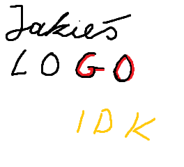

<h2 align="center">
  <br>
 
  <br>
  Java GO Game
  <br>
</h2>

<div align="center">
  
  <a href="">  </a>
  <a href="">  </a>
  <a href="">  </a>
  
</div>

<div align="center">

  
  
  
  


</div>

# Description

This project is a client-server implementation of the GO Game in Java, developed using JavaFX, Maven, JUnit, and MariaDB. It was created as a part of the 'Technology of Programming' course for the **Algorithmic Computer Science** major at the **Wrocław University of Science and Technology**.

## Game Modes

<p align="center">
  
  &nbsp; &nbsp; &nbsp; &nbsp;
  
</p>


## Run Locally

Clone the project

```bash
  git clone https://tkosman/TP-ProjectGO
  cd TP-ProjectGO
```

Compile 

```bash
  chmod +x ./install.sh
  ./install.sh
```

Run server

```bash
  cd go_server && mvn exec:java
```

Run client

```bash
  cd go_client && mvn javafx:run
```


## Running Tests

To run tests, run the following command

```bash
  chmod +x ./test.sh
  ./test.sh
```

## Project Team Members

### Backend Development
- <a href="https://github.com/tkosman">@tkosman</a>: Responsible for all backend development aspects of the project. This includes database management, server-side logic, API integration, and ensuring scalability and security of the backend infrastructure.

### Frontend Development
- <a href="https://github.com/wyz3r0">@Wyzero</a> Handles all frontend development tasks. This includes designing user interfaces, implementing user experience designs and integrating with backend services to provide a seamless user experience.
